# 07 — Conceptual ERD: IEEE 829/ISO 29119-3 Document Layer + ISTQB CTFL v4.0.1 Vocabulary Layer

**Status: conceptual/structural hypothesis, not implementation-ready.** This jumps ahead of the discovery sequence (noncustomer analysis, Blue Ocean canvas, value proposition, business model, and MVP cut in 08+ haven't run yet) — produced on direct request to make the standards-compatibility answer (06 follow-up) concrete. Treat every entity below as a candidate, not a commitment: which of these ship in an MVP is an MVP-scoping decision, not a discovery decision, and should be revisited once 08+ lands.

## Design principles behind this model

1. **Two layers, one schema.** IEEE 829/ISO 29119-3 governs *document shape* (what sections a Test Plan/Test Design Spec/Test Case Spec must have, entry/exit/suspension/resumption criteria, approvals). ISTQB CTFL v4.0.1 governs *vocabulary and technique* (test condition as a first-class traceable unit, test levels, test types, design techniques). The model below stores both natively instead of bolting standards compliance on as an export template — that native fit is the actual differentiation identified in the 06 follow-up.
2. **Human and AI agents are both first-class actors.** Per your stated strength (self-hosted + human/AI-agent collaboration), every "who did this" field (`created_by`, `executed_by`, `approved_by`) references an `Actor` supertype that can be a human `User` or an `AIAgent` session — not a bolted-on "automation flag" on a human-shaped user record. This matters for IEEE 829 Approvals (regulated buyers will ask "can an AI agent approve a test plan?" — the model should make that answerable, and by default: no, `Approval` should be restricted to `User` at the application layer even though the schema allows either).
3. **Traceability is a first-class link table, not implicit foreign keys.** Requirement → Test Condition → Test Case → Execution → Defect must be walkable in both directions to generate an audit-grade Requirements Traceability Matrix (RTM) on demand — this is the #1 validated pain (03) or #10 unmet need (03/04) this product exists to close.
4. **Test Log is append-only, separate from live Execution state.** ISTQB's "test log" is a chronological record; IEEE 829/29119-3 audits want an immutable history, not just current status. Modeling this as an event table (not just `updated_at` on `TestExecution`) is what makes "audit trail" a real, checkable claim rather than a marketing word.

5. **Multi-tenant from the schema root, not bolted on later.** `Organization` sits above `Project` as the isolation boundary. Retrofitting tenancy after MVP is one of the most expensive mistakes a self-hosted product can make — every core table below already carries a path back to `Organization` via `Project.org_id`, so this is a day-one decision, not deferred scope.
6. **RBAC scopes `Actor`, not just `User`.** The same permission system governs humans and AI agents. This turns the hardcoded "Approval is human-only" rule from principle #2 into one instance of a general policy (a permission simply never gets granted to `AIAgent`-type actors), instead of a special case — more auditable, and it means an org can also scope *what* an agent is allowed to touch (e.g., "this MCP agent may create test cases in Project X, never approve a test plan, never touch Project Y").

## Entity list (core = candidate for MVP; extended = compliance-depth, later phase)

**Core:** Organization, OrgMembership, AuthIdentity, Role, Permission, RoleAssignment, Project, Release, User, AIAgent, Requirement, TestCondition, TestCase, TestStep, TestSuite, TestPlan, TestCycle, Environment, TestExecution, Defect, TraceabilityLink

**Extended (standards-depth, likely post-MVP):** EntryExitCriteria, TestDesignTechnique, TestLevel, TestType, TestLog (as explicit event table vs. derived), Approval, RiskItem, Attachment

## Mermaid ERD

Single merged diagram — tenancy/auth/RBAC (top) plus the IEEE 829/ISTQB test-asset model (bottom), joined at `ORGANIZATION ||--o{ PROJECT` and `ACTOR`.

```mermaid
erDiagram
    ORGANIZATION ||--o{ ORG_MEMBERSHIP : "has members"
    ORGANIZATION ||--o{ PROJECT : "owns"
    ORGANIZATION ||--o{ ROLE : "defines custom roles"
    ORGANIZATION ||--o{ ROLE_ASSIGNMENT : "scopes"

    USER ||--o{ ORG_MEMBERSHIP : "belongs to org(s)"
    USER ||--o{ AUTH_IDENTITY : "logs in via"

    ACTOR ||--o{ ROLE_ASSIGNMENT : "assigned"
    ROLE_ASSIGNMENT }o--|| ROLE : "grants"
    ROLE_ASSIGNMENT }o--o| PROJECT : "optionally scoped to"

    ROLE ||--o{ ROLE_PERMISSION : "bundles"
    ROLE_PERMISSION }o--|| PERMISSION : "grants"

    PROJECT ||--o{ RELEASE : "has"
    PROJECT ||--o{ REQUIREMENT : "scopes"
    PROJECT ||--o{ TEST_SUITE : "organizes"
    PROJECT ||--o{ TEST_PLAN : "governs"

    RELEASE ||--o{ TEST_CYCLE : "targeted by"

    REQUIREMENT ||--o{ TEST_CONDITION : "decomposed into"
    REQUIREMENT ||--o{ RISK_ITEM : "carries"

    TEST_CONDITION ||--o{ TEST_CASE : "covered by"
    TEST_CONDITION }o--o{ TRACEABILITY_LINK : "linked via"

    TEST_CASE ||--o{ TEST_STEP : "composed of"
    TEST_CASE }o--o{ TEST_SUITE : "grouped in"
    TEST_CASE }o--o{ TEST_DESIGN_TECHNIQUE : "designed using"
    TEST_CASE }o--|| TEST_LEVEL : "targets"
    TEST_CASE }o--|| TEST_TYPE : "classified as"
    TEST_CASE ||--o{ ATTACHMENT : "may have"
    TEST_CASE }o--o{ TRACEABILITY_LINK : "linked via"

    TEST_SUITE }o--o{ TEST_PLAN : "included in"

    TEST_PLAN ||--o{ ENTRY_EXIT_CRITERIA : "defines"
    TEST_PLAN ||--o{ APPROVAL : "signed off by"
    TEST_PLAN ||--o{ TEST_CYCLE : "executed as"
    TEST_PLAN ||--o{ RISK_ITEM : "documents"

    TEST_CYCLE ||--o{ TEST_EXECUTION : "contains"
    TEST_CYCLE }o--|| ENVIRONMENT : "runs in"
    TEST_CYCLE ||--o{ ENTRY_EXIT_CRITERIA : "evaluated against"

    TEST_EXECUTION }o--|| TEST_CASE : "executes"
    TEST_EXECUTION ||--o{ TEST_LOG : "recorded in"
    TEST_EXECUTION ||--o{ DEFECT : "may raise"
    TEST_EXECUTION }o--|| ACTOR : "executed_by"

    DEFECT }o--o{ TRACEABILITY_LINK : "linked via"
    DEFECT }o--|| ACTOR : "reported_by"

    ACTOR ||--|| USER : "is-a"
    ACTOR ||--|| AI_AGENT : "is-a"

    TEST_PLAN }o--|| ACTOR : "created_by"
    TEST_CASE }o--|| ACTOR : "created_by"
    APPROVAL }o--|| USER : "approved_by (human only, policy-enforced)"

    TRACEABILITY_LINK }o--|| REQUIREMENT : "from/to"
    TRACEABILITY_LINK }o--|| TEST_CONDITION : "from/to"
    TRACEABILITY_LINK }o--|| TEST_CASE : "from/to"
    TRACEABILITY_LINK }o--|| DEFECT : "from/to"

    ORGANIZATION {
        uuid id PK
        string name
        string slug
        string default_standards_profile
    }
    ORG_MEMBERSHIP {
        uuid id PK
        uuid org_id FK
        uuid user_id FK
        string status "invited/active/suspended"
        datetime joined_at
    }
    AUTH_IDENTITY {
        uuid id PK
        uuid user_id FK
        string provider "local/oidc/saml/ldap/github/google"
        string external_id
        boolean is_primary
        datetime last_login_at
    }
    ROLE {
        uuid id PK
        uuid org_id FK "null = built-in system role template"
        string name
        boolean is_system_role
    }
    PERMISSION {
        uuid id PK
        string code "e.g. test_plan.approve, test_case.create"
        string resource
        string action
    }
    ROLE_PERMISSION {
        uuid role_id FK
        uuid permission_id FK
    }
    ROLE_ASSIGNMENT {
        uuid id PK
        uuid actor_id FK "User or AIAgent, via Actor"
        uuid org_id FK
        uuid project_id FK "nullable = org-wide role"
        uuid role_id FK
    }
    PROJECT {
        uuid id PK
        uuid org_id FK "tenant isolation root"
        string name
        string standards_profile "e.g. ISTQB-CTFL-v4.0.1 + ISO29119-3"
    }
    RELEASE {
        uuid id PK
        uuid project_id FK
        string version_label
        date target_date
    }
    REQUIREMENT {
        uuid id PK
        uuid project_id FK
        string external_ref "e.g. Jira/GitHub issue key"
        text description
        string source
    }
    TEST_CONDITION {
        uuid id PK
        uuid requirement_id FK
        text description "ISTQB: testable aspect derived from requirement"
        string priority
    }
    TEST_CASE {
        uuid id PK
        uuid test_condition_id FK
        uuid test_level_id FK
        uuid test_type_id FK
        uuid created_by_actor_id FK
        string title
        text preconditions
        text expected_result
        string status "draft/reviewed/approved/deprecated"
    }
    TEST_STEP {
        uuid id PK
        uuid test_case_id FK
        int sequence
        text action
        text expected_result
    }
    TEST_SUITE {
        uuid id PK
        uuid project_id FK
        string name
        string purpose "regression/smoke/acceptance/..."
    }
    TEST_DESIGN_TECHNIQUE {
        uuid id PK
        string name "equivalence partitioning, BVA, decision table, state transition, ..."
        string istqb_chapter_ref
    }
    TEST_LEVEL {
        uuid id PK
        string name "component/integration/system/acceptance"
    }
    TEST_TYPE {
        uuid id PK
        string name "functional/non-functional/structural/change-related"
    }
    TEST_PLAN {
        uuid id PK
        uuid project_id FK
        uuid created_by_actor_id FK
        string identifier "IEEE829/29119-3 Test Plan Identifier"
        text scope "Features to be tested / not tested"
        text approach
        text staffing_and_training
        text schedule
        string status "draft/approved/superseded"
    }
    ENTRY_EXIT_CRITERIA {
        uuid id PK
        uuid test_plan_id FK
        string type "entry/exit/suspension/resumption"
        text condition_text
    }
    RISK_ITEM {
        uuid id PK
        uuid requirement_id FK
        uuid test_plan_id FK
        text description
        string likelihood
        string impact
        string mitigation
    }
    APPROVAL {
        uuid id PK
        uuid test_plan_id FK
        uuid approved_by_user_id FK
        datetime approved_at
        string role "policy: human User only, never AIAgent"
    }
    TEST_CYCLE {
        uuid id PK
        uuid test_plan_id FK
        uuid release_id FK
        uuid environment_id FK
        string name
        date start_date
        date end_date
    }
    ENVIRONMENT {
        uuid id PK
        string name
        text config_notes
    }
    TEST_EXECUTION {
        uuid id PK
        uuid test_cycle_id FK
        uuid test_case_id FK
        uuid executed_by_actor_id FK
        string result "pass/fail/blocked/skipped"
        text actual_result
        datetime executed_at
    }
    TEST_LOG {
        uuid id PK
        uuid test_execution_id FK
        datetime logged_at
        string event_type "status_change/comment/attachment/agent_action"
        text payload
    }
    DEFECT {
        uuid id PK
        uuid test_execution_id FK
        uuid reported_by_actor_id FK
        string external_ref "synced bug-tracker id"
        string severity
        string status
    }
    ATTACHMENT {
        uuid id PK
        uuid test_case_id FK
        string url_or_path
        string mime_type
    }
    ACTOR {
        uuid id PK
        string actor_type "user/ai_agent"
    }
    USER {
        uuid id PK
        uuid actor_id FK
        string name
        string email
    }
    AI_AGENT {
        uuid id PK
        uuid actor_id FK
        string agent_name
        string model_or_provider
        string mcp_session_ref
        uuid acting_on_behalf_of_user_id FK "accountability link, not a real approver"
    }
    TRACEABILITY_LINK {
        uuid id PK
        string from_type
        uuid from_id
        string to_type
        uuid to_id
        string link_kind "verifies/derives/blocks/duplicates"
    }
```

## Multi-tenancy, authentication & RBAC (folded into the diagram above)

Every table already carries a path back to `Organization` through `Project.org_id`, so tenant isolation is enforced at the schema root — a query without an `org_id` filter simply can't happen, not a convention developers have to remember. Three distinct concerns, kept as three sub-models rather than one bloated `User` table:

- **Multi-tenancy** (`Organization`, `OrgMembership`): one deployment serves many orgs, each org's data is isolated, and a single `User` can belong to more than one org (a real pattern for consultants, contract auditors, or a vendor testing multiple client codebases in one self-hosted instance).
- **Authentication** ("multiple user login" — `AuthIdentity`): a `User` is not tied to one login method. Supports local password, SSO/OIDC, SAML, LDAP (matches what Kiwi TCMS already offers per 01/04 research — table stakes, not differentiation), and per-provider `external_id`/`last_login_at` for audit purposes.
- **RBAC** (`Role`, `Permission`, `RolePermission`, `RoleAssignment`): scoped per org and, optionally, per project — so a user can be `org_admin` at the org level and `tester` on Project A but have no access at all to Project B in the same org. `RoleAssignment.actor_id` points at `Actor` (not `User` directly), which is what lets an `AIAgent` be granted a bounded role too (e.g., "MCP agent may create/edit test cases, may never approve a test plan") — the same mechanism that enforces the human-only `Approval` rule from the core model, generalized. Note `USER` no longer carries a free-text `role` field — `RoleAssignment` is the single source of truth for who can do what, which is what makes it auditable.

Built-in system roles worth seeding (not exhaustive, an MVP-scoping decision): `org_admin` (org settings, billing, membership), `test_manager` (test plans, approvals, RTM/reporting), `tester` (test case authoring/execution, no approvals), `auditor` (read-only + RTM export, no write access at all — a distinct role regulated buyers specifically ask for), `ai_agent_scoped` (create/edit test cases and executions only, no approvals, no membership/role management — the default bound applied to any MCP-connected agent).

## How this answers the compatibility question

| Standard | Where it lives in the model |
|---|---|
| **IEEE 829 / ISO 29119-3** (document shape) | `TestPlan` fields map directly to the standard Test Plan sections (Identifier, Scope, Approach, Staffing, Schedule); `EntryExitCriteria` covers entry/exit/suspension/resumption explicitly as structured rows, not prose; `Approval` covers the standard's Approvals section with a real sign-off record; `RiskItem` covers "Software Risk Issues." A `TestPlan` + its `EntryExitCriteria` + `Approval` rows can be rendered straight into a compliant document export. |
| **ISTQB CTFL v4.0.1** (vocabulary/technique) | `TestCondition` exists as the first-class unit ISTQB defines above test case (the gap Kiwi TCMS has, per last answer); `TestLevel`/`TestType` are structured lookups, not free-text tags; `TestDesignTechnique` lets a test case declare which CTFL Chapter 4 technique it was designed with — enables reporting like "% of test cases using a documented design technique," which no competitor in this research offers. |
| **Human/AI collaboration (your stated strength)** | `Actor` supertype (`User` \| `AIAgent`) on every `created_by`/`executed_by`/`reported_by` field gives full provenance without special-casing agents. `Approval` is policy-restricted to `User` — an auditor's first question ("can an AI approve a test plan?") has a structural "no" baked into the model, which is a trust signal, not just a feature. `AIAgent.mcp_session_ref` ties agent actions back to the MCP session that performed them, and `acting_on_behalf_of_user_id` preserves human accountability for agent-generated content — relevant once you have a first-party MCP server (06) generating test cases/executions. |

## Open design questions (carry into MVP scoping)

1. Is `TestCondition` worth the adoption-friction cost of an extra mandatory layer between Requirement and TestCase for teams who don't care about CTFL rigor? Possibly make it **optional** — allow `TestCase.test_condition_id` to be nullable, with a direct `TestCase → Requirement` traceability link as the lightweight path, and `TestCondition` as the opt-in rigor path. Needs interview validation on adoption friction, not just standards purity.
2. `TraceabilityLink` as a generic polymorphic table is flexible but weaker on referential integrity/DB-level enforcement than dedicated join tables per pair (`RequirementTestCondition`, `TestCaseDefect`, etc.). Trade-off: one RTM query engine vs. cleaner schema — worth a spike before committing.
3. `TEST_LOG` as an explicit event table vs. relying on a generic audit-log/event-sourcing layer applied uniformly across all entities (not just executions) — the latter might be the better long-term answer for audit-trail claims generally, not just test logs.
4. None of this is validated against an actual regulated-buyer interview yet — this ERD encodes the *hypothesis* that test-condition-level traceability and structured entry/exit criteria are what such buyers need. That's still unconfirmed (see 06's open questions).
5. Multi-tenancy raises a self-hosted-specific question this research hasn't answered yet: **do self-hosting buyers actually want multi-org support, or is single-org-per-deployment the expected model?** Most self-hosted tools (Kiwi TCMS included, per 01/04) are deployed one-instance-per-org; multi-tenant self-hosted is more of a "run it as a service for multiple clients" pattern (relevant to MSPs/consultancies, or if this product itself is later offered as hosted SaaS). If the validated buyer is a single regulated enterprise standing up its own instance, `Organization` may collapse to exactly one row forever and the multi-tenancy layer is speculative complexity, not MVP scope — **needs the same interview validation as everything else before committing.**

## Sources
- [Wikipedia — Software test documentation (IEEE 829)](https://en.wikipedia.org/wiki/Software_test_documentation)
- [IEEE SA — 829-2008 standard record](https://standards.ieee.org/ieee/829/3787/)
- [Evoke Technologies — ISO/IEC/IEEE 29119 overview](https://www.evoketechnologies.com/blog/software-testing/new-software-testing-standards/)
- [ASTQB — ISTQB Glossary v2.3](https://astqb.org/assets/documents/ISTQB_glossary_of_testing_terms_2.3.pdf)
- ISTQB CTFL Syllabus v4.0.1 (https://istqb.org/wp-content/uploads/2024/11/ISTQB_CTFL_Syllabus_v4.0.1.pdf)
- [06 — AI & MCP Landscape](06-ai-mcp-landscape.md) (this session, prior turn)
