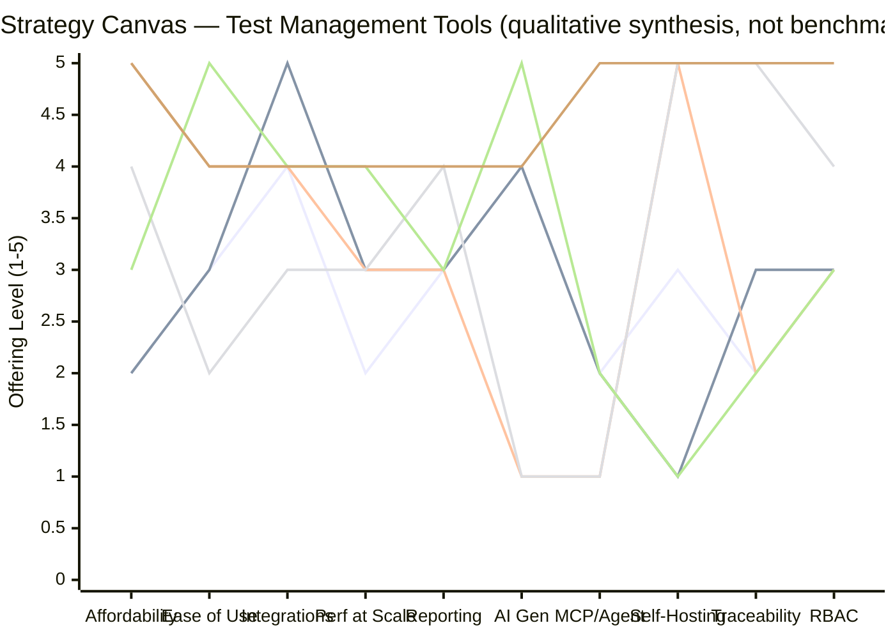

# 09 — Strategy Canvas

**Note on numbering:** requested as "07 — Strategy Canvas," renumbered to 09. See [00-overview.md](00-overview.md) for the full index.

## Method and an honest caveat

A Blue Ocean strategy canvas plots each competitor's relative offering level across the industry's competing factors, to reveal whether the industry has converged on one shared value curve (a "red ocean") or whether gaps/uncontested space exist. The scores below are **not measured benchmark data** — no independent lab tested these products side by side. They are a **qualitative synthesis (INSIGHT/ASSUMPTION, clearly not FACT)**, built by translating the evidence already gathered in 01–08 (review-site complaints, vendor feature pages, pricing pages) into a relative 1–5 scale per factor. Treat the *shape* and *relative gaps* as the useful output, not the precise numbers — and validate directionally against real user interviews before using this to justify spend.

Nine factors carried over from 08 (three dropped for canvas readability — vendor support, workflow customization, community maturity — as they track closely with deployment-model and complexity, already captured elsewhere). "Affordability" is used instead of raw price so that, per strategy-canvas convention, **higher is always better** on every axis.

## Scores (1 = weak/absent, 5 = strong, qualitative synthesis)

| Factor | TestRail | Jira-native (Xray/Zephyr) | Kiwi TCMS | Squash TM | Modern SaaS (Qase) | **Proposed idea (target)** |
|---|---|---|---|---|---|---|
| Affordability | 2 | 2 | 5 | 4 | 3 | 5 |
| Ease of use | 3 | 3 | 4 | 2 | 5 | 4 |
| Integrations (Jira/CI/bug-tracker) | 4 | 5 | 4 | 3 | 4 | 4 |
| Performance at scale | 2 | 3 | 3 | 3 | 4 | 4 |
| Reporting customization | 3 | 3 | 3 | 4 | 3 | 4 |
| AI test generation | 4 | 4 | 1 | 1 | 5 | 4 |
| First-party MCP/agent support | 2 | 2 | 1 | 1 | 2 | 5 |
| Self-hosting & data control | 3 | 1 | 5 | 5 | 1 | 5 |
| Standards traceability depth | 2 | 3 | 2 | 5 | 2 | 5 |
| RBAC / multi-tenant governance | 3 | 3 | 3 | 4 | 3 | 5 |

*Sources for each competitor's row: TestRail/Xray/Zephyr/Qase from 05 and 06; Kiwi TCMS/Squash TM from 04, 05, and the direct feature/terminology check run earlier this session against [kiwitcms.org/features](https://kiwitcms.org/features/). "Proposed idea" row is the design target from 07's ERD, not a built/measured product — pure HYPOTHESIS.*

## Mermaid visualization

Line order (Mermaid's `xychart-beta` doesn't render a legend as of the current renderer — matching order to the table above): **1) TestRail, 2) Jira-native (Xray/Zephyr), 3) Kiwi TCMS, 4) Squash TM, 5) Qase, 6) Proposed idea.**

## Dominant competitive pattern

**INSIGHT:** Five of six curves converge tightly on the same mid-range band (2–4) across Integrations, Performance, Reporting, and RBAC — the classic Blue Ocean signature of a **"sea of sameness."** Competitors are fighting over the same table-stakes factors (08) and differentiating only at the margins. Two factors break that pattern sharply:

1. **Self-hosting vs. AI/MCP is currently a forced trade-off, not a spectrum.** Every real competitor scores high on at most *one* of {Self-hosting, AI generation, MCP/agent support} and low on the others. Kiwi TCMS and Squash TM own self-hosting (5) but score at rock-bottom on AI/MCP (1). Qase owns AI (5) but scores at rock-bottom on self-hosting (1). **No incumbent occupies the top-right of that trade-off.** This is the same finding as 06, now visible geometrically rather than just narratively — a second, independent confirmation.
2. **Traceability depth is nobody's strong suit except Squash TM**, and even there it comes bundled with the weakest Ease-of-Use score (2) in the set — the market currently makes buyers choose between "traceability-capable" and "pleasant to use," which is itself a value-innovation opportunity (a factor combination Blue Ocean theory calls "eliminate the trade-off," not just "beat the average").

**RECOMMENDATION (still a hypothesis, needs validation):** The "Proposed idea" curve isn't drawn to look impressive for its own sake — it specifically targets the two factors (Self-hosting+MCP, and Traceability+Ease-of-use) where the real curves force a trade-off no competitor has resolved. That combination, not "be better at everything," is what the ERRC grid (10) should be built to defend — spreading effort evenly across all ten factors would just produce another mid-pack curve indistinguishable from the rest.

## Sources
- [08 — Industry Factors](08-industry-factors.md)
- [04 — Current Solutions](04-current-solutions.md)
- [05 — Competitor Map](05-competitor-map.md)
- [06 — AI & MCP Landscape](06-ai-mcp-landscape.md)
- [07 — Conceptual ERD](07-erd-draft.md)
- [Kiwi TCMS — Features matrix](https://kiwitcms.org/features/)
